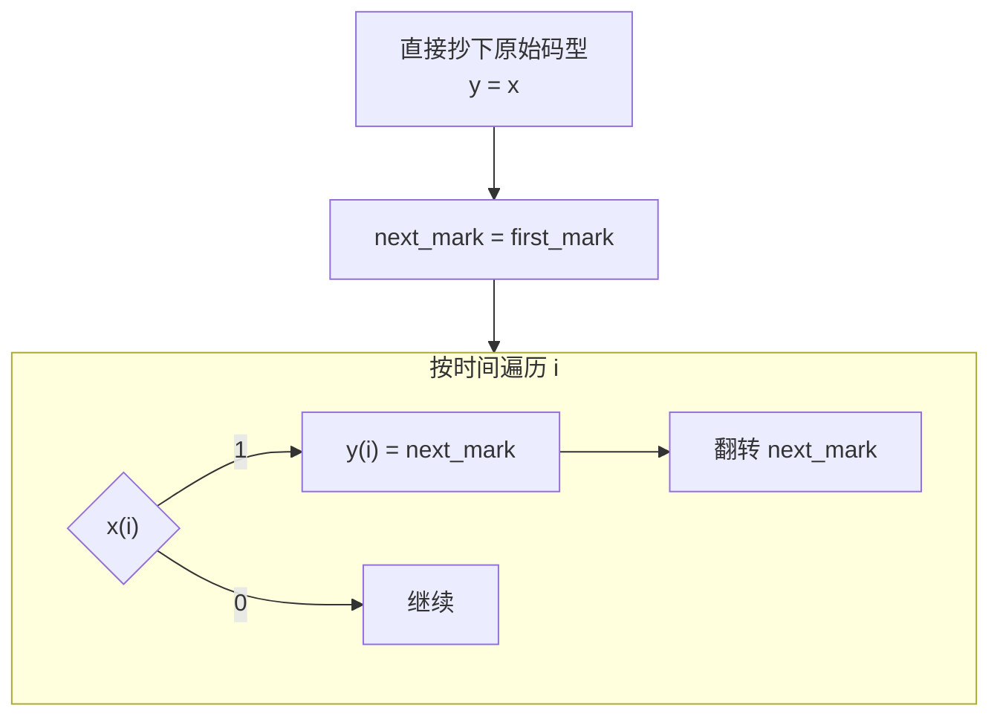
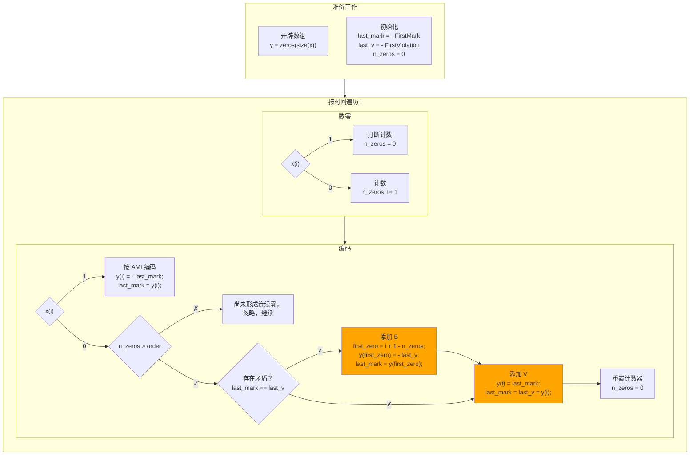
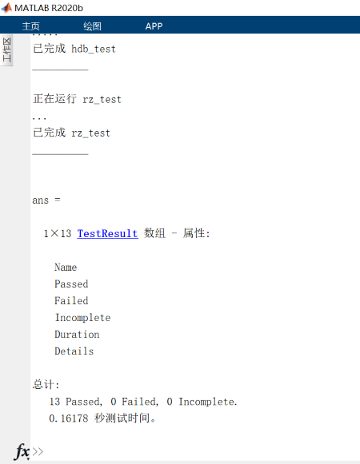

# 一、数字基带传输系统仿真

$$
\newcommand\SI[2]{#1\ \mathrm{#2}}  % siunitx (package)
$$

## 1 简介

### 背景知识

- **基带信号**是频谱分布在零频或低频附近，未经调制的信号。
- 为了匹配信道传输特性，基带信号传输前一般要**变换**码型、波形等，修正信号特性。
- **数字**基带信号表示为消息代码的电波形。无直流分量有利于在信道传输，定时信息有利于接收端同步。从功率谱可分析定时信息。

### 目标

1. 掌握数字基带传输系统基本知识。
2. 熟悉Matlab环境并编写函数实现功能。
3. 熟悉实验报告的规范写作方法。

## 2 基本原理和算法

### 波形

<figure>
    
    <figcaption>数字基带信号的各种二进制波形｜<a href='https://commons.wikimedia.org/wiki/File:Digital_signal_encoding_formats-en.svg'>Wikimedia Commons</a></figcaption>
</figure>

- **不归零**和**归零**

  按脉冲宽度是否占据整个码元宽度，波形可分为不归零（non-return-to-zero，NRZ）、归零（return-to-zero，RZ），占据比例称作占空比。

- **单极性**和**双极性**

  电平只取正值或零的称作单极性（上图除 Bipolar 以外的所有波形），电平可正可负的称作双极性（bipolar）。

  双极性波形可以让直流分量是零，有利于在信道传输。同时它可以让判决电平是零，与信号幅度无关，让译码更稳定。

- **绝对**与**相对**

  只有当前码元决定的是绝对，当前码元相对前一码元决定的是相对。相对码又称差分（differential）码，如上图 Differential manchester。

  相对码排除了初始状态对波形的影响，接收端译码时没有歧义。

### 功率谱

数字基带信号的功率谱离散（Dirac δ）、连续（普通函数）两部分。离散谱由稳态分量决定，影响直流、定时；连续谱由交变分量决定，影响带宽。

若假设所有码元及其波形相互独立，可用信源分布、每种码元的波形解析表示出功率谱密度；然而本项目涉及的码全都不满足条件，故不再赘述。

### 具体编码

- **AMI**（Alternative Mark Inversion）

  0发0，1交替发 ±1。

  无论信源怎样分布，都保证没有直流。

- **HDB**（High Density Bipolar）

  为保证定时分量，需避免连续零。

  连续0 → `00…0V` / `B0…0V`。（保证编码后连零数量不超过 order，order 实用时常取 3）

  - V (Violation) 同时满足两个条件：
    - （V之间）交替 ±1 ——保证平均仍是零。
    - 极性与前一号相同（“前一号”包括原有1和新加的V、B）——方便译码。
  - V 的两个条件可能矛盾，于是要引入 B (Balance)。

## 3 编程实现

### 生成数字基带信号`generate_signal.m`

返回一个长为 n 的信号，码元只有0、1，其中1的概率为p。（即 Bernoulli 分布）

1. 先在 $(0,1)$ 生成均匀分布的随机数。
2. 取值小于`p`的作为 1，其它作为 0。
3. 将 logical 数组转换为 numbers。

实际代码如下。其中 arguments 块验证数据类型，不影响程序逻辑，所以我们下面都省略。注释已涵盖在正文，我也不再重复，读者您可阅读附件中源代码或用`help <我的函数名>`查看。

```matlab
function signal = generate_signal(n, p)
%generate_signal - 生成二进制随机信号
%
% signal = generate_signal(n, p) 返回一个长为 n 的信号，码元只有0、1，其中1的概率为p。（即 Bernoulli 分布）
arguments
    n(1,1) {mustBePositive, mustBeInteger}
    p(1,1) {mustBePositive, mustBeNumeric, mustBeLessThanOrEqual(p,1)}
end

signal = rand(1, n) < p;

% logical → numbers
signal = 1 * signal;

end
```

### AMI 编码`ami.m`

输入原始码`x`，输出 AMI 码。注意输出仍是数字信号，不涉及具体波形，下同。

如果码中包含 1，那么 AMI 编码有多种选择：将所有 ±1 对调，仍是合理且同义的 AMI 码。为此我设计了`first_mark`参数来限定。



### HDB 编码`hdb.m`

输入原始码`x`、最大允许连零个数`order`，输出 HDB 码。

序列较长时，HDB 编码总有多种选择，我也设计了一些参数来限定，如下。

- `FirstMark`：首个“1”的编码，取 ±1。

  编码后将所有 ±1 对调，码仍然有效且同义。

- `FirstViolation`：首个V的选取方法，±1 人为指定，0 不限制。

  V 的两个条件都涉及“上一个 V”或“上一个 1”，而序列开头它们可能不存在，这就有了自由度。

HDB 需在 AMI 基础上添加 V、B。

- AMI 基础——`last_mark`。
- 连续0 → `00…0V` / `B0…0V` ——我们用`n_zeros`记录连续零的个数。
- V (Violation) 同时满足两个条件：
  - 交替 ±1 ——我们用`last_v`记录上一个 V。
  - 极性与前一号相同——沿用`last_mark`，这个变量兼顾普通 1 和 V、B。
- V 的两个条件可能矛盾，于是要引入 B (Balance) ——添加 V 时检查，若矛盾，退回去添加 B。



### 生成归零波形`rz.m`

输入数字序列里`x`、采样率`f`，输出波形`y`。

每个码元的波形为矩形，占空比可用`DutyRatio`指定。

1. 制备每个码元的波形。

   ```matlab
   n_nonzeros = round(f * options.DutyRatio);
   n_zeros = f - n_nonzeros;
   % 每个码元的波形就是 [ones(1, n_nonzeros) zeros(1, n_zeros)]
   ```

2. 按每个码元的波形分组，先构造矩阵。`y_mat`的维度依次是慢时间（码元序号）、快时间（当前码元中的采样序号）。

   ```matlab
   y_mat = x' * [ones(1, n_nonzeros) zeros(1, n_zeros)];
   ```

3. 压平。

   ```matlab
   y = reshape(y_mat.', 1, []);
   ```

### 测试`○○_test.m`

> 这些单元测试是和以上模块同时写的，只是单独列出来。

单元测试我采用基于脚本的测试框架。例如`rz_test.m`测试`rz`，如下。

```matlab
signal = [0 1 -1 0];
n = length(signal);

% ……

%% Double rate, half duty
assert(isequal( ...
    rz(signal, 2, 'DutyRatio', 0.5), ...
    [0 0 1 0 -1 0 0 0] ...
));
```

这些测试除了验证功能（如下面第一段），还帮助我发现了 AMI、HDB 的歧义（如下面第二段），并最终明确下来（如下面第三段，同样给四个零编码，HDB-3 有多种选择）。

```matlab
%% Consecutive zeros
assert(isequal(hdb([0 0 0], 3), [0 0 0]));
assert(isequal(hdb([0 0 0 0], 3), [0 0 0 +1]));
assert(isequal(hdb([0 0 0 0], 4), [0 0 0 0]));
```

```matlab
%% The example on slide (§6.2.2.1, page 39)
assert(isequal( ...
    hdb([1 0 0 0 0 1 0 0 0 0 1 1 0 0 0 0 0 0 0 0 1 1], 3), ...
    [-1 0 0 0 -1 1 0 0 0 +1 -1 +1 -1 0 0 -1 +1 0 0 +1 -1 +1] ...
));
```

```matlab
%% Set first violation and first mark
assert(isequal( ...
    hdb([0 0 0 0], 3, 'FirstMark', -1, 'FirstViolation', -1), ...
    [-1 0 0 -1] ...
));
assert(isequal( ...
    hdb([0 0 0 0], 3, 'FirstMark', -1, 'FirstViolation', +1), ...
    [0 0 0 +1] ...
));
% ……
assert(isequal( ...
    hdb([0 0 0 0], 3, 'FirstMark', +1, 'FirstViolation', -1), ...
    [0 0 0 -1] ...
));
% ……
```

### 主函数`main.m`等

> 其实并不能叫主“函数”——`main.m`会打印文字、输出图片，高度特化于实验要求，我没有写成函数。

虽说要随机生成码元，但只显示开头，不一定碰到连续零，可能展示不出 HDB-3。因此我指定了随机数种子。

```matlab
rng(44); % 保证碰到连续零，以展示 HDB-3
```

#### 1 生成的信号

调用刚才的函数即可。

```matlab
fprintf('## 1 生成的信号\n\n')
raw = generate_signal(1000, 0.3);
fprintf('平均值是 %.3f ≈ 0.3，符合预期。\n', mean(raw));
fprintf('开头符号如下。\n');
raw(1:20)
```

然后画图。画图代码比较繁琐，意义不大，后面不再完整罗列，请直接参考附件源代码。

```matlab
figure('Name', '各序列、波形开头');
subplot(3, 1, 1);
stem(raw(1:20));
title(join(["信源序列：" string(raw(1:20))]));
xlabel('$n$ / symbol', 'Interpreter', 'latex');
ylabel('信源');
ylim([-0.2 1.2]);
% 这里画序列，而后面画波形，二者默认长度不完全相同。
xlim([1 21]);
grid 'on';
```

这里只画前 20 点，横坐标范围是1, …, 20，却设置`xlim([1 21])`，是因为下面波形的横坐标范围是 $[1,2),\, [2, 3), \ldots, [20, 21)$，总共 $[0, 21)$，多留个空白方便对齐。

#### 2 AMI

直接调用即可。

```matlab
fprintf('## 2 AMI\n\n')
ami_seq = ami(raw);
fprintf('AMI 开头符号如下。\n');
ami_seq(1:20)

subplot(3, 1, 2);
ami_wave = rz(ami_seq, 8);
plot(ami_wave(1: 8*20));
% ……（画图）……
```

采样率是码率的 8 倍，故`ami_wave = rz(ami_seq, 8)`。画图只画前 20 个码元，对应前 8×20 个采样点。

#### 3 HDB

同 AMI。

```matlab
fprintf('## 3 HDB\n\n')
hdb_seq = hdb(raw, 3);
fprintf('HDB3 开头符号如下。\n');
hdb_seq(1:20)

subplot(3, 1, 3);
hdb_wave = rz(hdb_seq, 8);
plot(hdb_wave(1: 8*20));
% ……（画图）……

exportgraphics(gcf(), '../fig/time.jpg');
fprintf('请看各个序列、波形开头。\n\n');
```

#### 4 功率谱

我们使用`periodogram`计算、绘制功率谱。这样出来的横坐标是数字频率，而我们其实关心模拟频率，二者不同，我会在分析时进一步解释。

```matlab
fprintf('## 4 功率谱\n\n');

% ……（画图）……
periodogram(ami_wave);
% ……（画图）……
periodogram(hdb_wave);
% ……（画图）……
```

#### 几种展示功率谱的方法`misc_periodogram.m`

因为数据只有有限长，上面画出来全是毛刺，看不清。我尝试了其它方法。

- **单次原始**：即上面的方法。
- **单次滑动平均**：像上面一样计算出功率谱，然后对频率滑动平均这个功率谱密度，当作实际的功率谱密度。
- **多次平均**：重复很多次实验，像上面一样计算出每一次的功率谱（因为信号随机，每次结果不完全相同），然后相同频率上每次的功率谱密度做平均，合并成一张功率谱作为实际的功率谱密度。

这些方法的意义、效果等到后面再分析，这里只介绍编程实现。

```matlab
l = 10000; % 数字序列长
p = 0.3; % 1 的概率
n = 10; % 重复次数
```

1. 连续生成很多次（`n`次）波形，`reshape`为`wave_set`，其维度依次为时间、实验序号。

   ```matlab
   %% 生成一系列原始功率谱
   raw_set = generate_signal(n * l, p);
   wave_set = rz(ami(raw_set), 8);
   wave_set = reshape(wave_set, [], n);
   ```

2. 用`periodogram`计算所有实验的功率谱密度`pxx_set`，其维度依次为频率、实验序号。

   ```matlab
   [pxx_set, w] = periodogram(wave_set);
   ```

3. 按三种方法分别处理。

   ```matlab
   %% 处理
   powers = [ ...
       pxx_set(:,1) ...
       movmean(pxx_set(:, 1), 10) ...
       mean(pxx_set, 2) ...
   ];
   labels = ["单次原始" "单次滑动平均" "多次平均"];
   ```

   - **单次原始**：挑出第一次实验的数据，直接作为功率谱密度。
   - **单次滑动平均**：挑出第一次实验的数据，对它应用长 10 的滑动平均，作为功率谱密度。
   - **多次平均**：使用所有实验数据，在第二个维度（实验序号）应用平均，作为功率谱密度。

4. 画图。

#### 5 改变信源`main_5.m`等

遍历不同的`p`，画在一起即可。

```matlab
% 零的概率
prob = [1e-2, .1: .2: .9, 1 - 1e-2];

% ……（画图）……
hold on;

for p = 1 - prob
    raw = generate_signal(1000, p);
    ami_seq = ami(raw);
    ami_wave = rz(ami_seq, 8);
    [pxx, w] = periodogram(ami_wave);
    plot(w / pi, 10 * log10(pxx));
end

% ……（画图）……
```

以上按“单次原始”，我后来改成了“多次平均”，需重复实验并平均。

```matlab
% 零的概率
prob = [1e-2, .1: .2: .9, 1 - 1e-2];
l = 10000; % 数字序列长
n = 10; % 重复次数


% ……（画图）……
hold on;

for p = 1 - prob
    raw_set = generate_signal(n * l, p);
    wave_set = rz(ami(raw_set), 8);
    wave_set = reshape(wave_set, [], n);

    [pxx_set, w] = periodogram(wave_set);
    pxx = mean(pxx_set, 2);

    plot(w / pi, 10 * log10(pxx));
end

% ……（画图）……
```

## 4 仿真结果和分析

### 1 生成的信号、2 AMI、3 HDB

```matlab
>> main
## 1 生成的信号

平均值是 0.271 ≈ 0.3，符合预期。
开头符号如下。

ans =
    0  1  0  0  0  0  0  0  0  0  0  0  0  1  1  0  0  0  0  1

## 2 AMI

AMI 开头符号如下。

ans =
    0 -1  0  0  0  0  0  0  0  0  0  0  0  1 -1  0  0  0  0  1

## 3 HDB

HDB3 开头符号如下。

ans =
    0 -1  0  0  0 -1  1  0  0  1  0  0  0 -1  1 -1  0  0 -1  1

请看各个序列、波形开头。
```

<figure>
    
    <figcaption>各个序列、波形开头</figcaption>
</figure>

1. 第一行**信源符号**是离散序列，自变量只取 $\Z$，因变量只取 0、1。

   因变量的平均值约等于 1 的概率（0.3），符合预期。

2. 第二行 **AMI** 是连续波形，$\R\to\R$。

   - <u>矩形波</u>：本来该完全竖直，但采样率较低（仅是码率的8倍），所以连线稍斜。

   - <u>对齐</u>：AMI 的上升沿与第一行的 1 对齐，$t \propto n$，倍数是采样率与码率之比，也就是 8。

     例如第一行`n = 14`有个 1，$\SI{14}{symbols} \times \SI{8}{samples/symbol} = \SI{112}{samples}$，从第二行`t = 112`确实升起了矩形波。注意“升起”应该看斜线终点 ±1 而非起点 0。

   - <u>归零</u>：要求占空比为一半，即每个矩形波的宽度是码元重复周期的一半。

     例如第一行`n = 14, 15`连着 1。在第二行`100 < t < 120`区域，前一矩形波的终点，恰好是“前一波形起点与后一波形起点连线”的中点，符合预期。

   - <u>Alternative mark</u>：第二行正负矩形波交错。

3. 第三行 HDB-3，自变量、因变量、矩形波、对齐、归零都和 AMI 一样。

   容易验证第三行符合 HDB-3 编码规则，不存在超过3的连续零。（3 symbols × 8 samples/symbol = 24 samples ≈ 第三行一横格）

   下面我们再用译码检查一下：找出所有没变号的脉冲，清空它们以及前面相邻三个码元，确实和 AMI 矩形波位置一样了。

### 4 功率谱

#### 区别

这里的功率谱和一般（如）有两处不同。

- 一般功率谱[^1]的自变量是**模拟频率**（rad/s），而这里是数字频率（rad/sample）。

  二者成正比，倍数是采样率或采样周期。

- 一般功率谱的定义包含**极限和数学期望**，而这里没有，顶多有算术平均。
  $$
  P \coloneqq \lim_{T\to+\infty} \frac{1}{T} \operatorname{\mathbb E} \abs{X_T}^2.
  $$
  一般定义如上，而这里求的只是 $\abs{X_T}^2$，或其算术平均。

[^1]:如参考文献 2. 140页图6-4。

#### AMI

<figure>
    
    <figcaption>AMI 的功率谱</figcaption>
</figure>

上图是单次实验计算出的功率谱，横坐标表示数字频率，纵坐标按对数表示功率谱密度。

> 横坐标范围本来该是 $\omega \in [0,2\pi)$，但信号是实序列，频谱共轭对称，功率谱偶对称，所以只画 $[0,\pi]$ 就够了。

因为这样求出的功率谱没有极限、数学期望，毛刺很多。这里先将就分析，后面会处理。

- **零点**

  由于纵轴按对数，零点在图上对应 $(\omega/\pi, -\infty)$。由图，零点处 $\omega/\pi =0,\frac14, \frac12, \frac34, 1$。

  > 关于 $\pi$ 对称的那些点也是零点，略去不表。

  模拟频率 $f$ = 采样率 × 数字频率 = 8 倍码率 × 数字角频率 / ($2\pi$)。因此这些零点相当于 $0,1,2,3,4$ 倍码率。

  > 如果像书上一样按模拟频率绘图，应当只看上图 $\omega/\pi \in [0, 2\pi/8]$ 的部分。
  >
  > 然而我们波形时间范围有限，缺乏极限、数学期望，只有按数字频率绘图才合理。

- **能量范围**

  由图，能量分布于零点之间。越原理零点，功率谱密度趋势上大致越大。

从这些特征可总结出 AMI 归零波形的特点：

- 低频（零频）、高频（码率）成分都少，能量集中在半倍码率处。
- 零频是零点，无直流分量。

#### HDB

<figure>
    
    <figcaption>HDB-3 的功率谱</figcaption>
</figure>

HDB-3 的功率谱与 AMI 类似，只是能量在零点之间并不形成一个峰，而是在中心附近两侧各形成一个峰。

例如图中 $\omega/\pi = 0.6$ 附近两个零点是 $\omega/\pi = \frac12, \frac34$，连线中点是 0.625。这一区间的功率谱密度仍大题分布在零点之间，但在 0.625 附近略微下凹，形成双峰。

根据这些特征，HDB-3 保有 AMI 的特点，只是定时信息更丰富。

### 几种展示功率谱的方法

能否消除毛刺呢？三种方法已介绍了编程实现，现在来看结果。

<figure>
    
    <figcaption>AMI 的功率谱<br>从左到右的方法分别是单次原始、单次滑动平均、多次平均。</figcaption>
</figure>

从结果看，与“单次原始”相比，“单次滑动平均”“多次平均”都抑制了毛刺，符合目标，并且后者效果更好。

从原理看，这里计算的功率谱缺少极限和数学期望。

- **极限** $\lim_{T\to+\infty} \frac{1}{T}$ ：无论哪种方法，我们都是用 DFT 而非 DFS，相当于周期化了波形，缓解了这一点。
- **数学期望** $\operatorname{\mathbb E}$：“单次原始”用单个样本估计期望，无偏但误差较大。“多次平均”用均值估计期望，因而有效、无偏、相合。而“单次滑动平均”则无甚道理，只是单纯平滑数据，除非功率谱“各态历经”（这并不可能），这种方法一般不足为信。

因此，“单次原始”可做简单估计，“多次平均”则是更好的估计。

### 5 改变信源

<figure>
    
    <figcaption>不同信源最终 AMI 的功率谱（单次原始）<br>相同颜色表示相同信源，映射关系如右上角。</figcaption>
</figure>

上图是不同信源最终 AMI 的功率谱，“单次原始”。可以看到毛刺都混一起了，我们还是看“多次平均”吧。

<figure>
    
    <figcaption>不同信源最终 AMI 的功率谱（多次平均）<br>相同颜色表示相同信源，映射关系如右上角。</figcaption>
</figure>

- 所有图线的**零点**一致，**单调性、最大值点**几乎一致。

  因此，无论什么信源，AMI 都具有以下特征。

  - 低频（零频）、高频（码率）成分都少，能量集中在半倍码率处。
  - 无直流分量。

- 1 的概率越高，**图线整体**越靠上，0 的概率越高，图线整体越靠下。

  一方面，总功率正比于单位时间内 1 的数量，从而正比于 1 的概率。另一方面，总功率等于功率谱密度的积分（模拟是在全实轴，数字是在一个周期），越大，图线整体越靠上。

- 1 的概率越高，**能量**越**集中**在半倍码率处；0 的概率越高，能量越分散在零频到码率整个区间。

  1 的概率最大（0.99，相应 0 的概率是 0.01）那条线在半倍码率处向上突出几十 dB；0 的概率最大（0.99）那条线几乎水平。

  这是因为，1 越多，编码后交错 ±1 越多，±1 越容易相邻；0 越多，编码后 ±1 越少，相邻 ±1 间距越大。而全是 1 时，编码后为连续交错 ±1，出现“2 × 码元持续时间”的周期，对应半倍码率，在功率谱此处冲激。

## 5 结论

- **数字基带传输系统**

  AMI、HDB 抑制了原始信号的直流分量，更适于传输；HDB 还保证了定时信息丰富。

  用它们编码后，功率谱会集中在中频附近。信源 1 的概率越高，则越集中。

  （本项目着重研究发送端，信道、接收端将在后面项目研究。）

- **测试很有意义**

  测试不仅帮助事前设计结构、事后验证功能，还有心理上的积极作用——每写一段程序，输入`runtests`，测试如果全通过了，就非常开心，成就感油然而生，有信心继续完成项目。

  

  测试代码虽然最终无用，但我会尽量坚持下去的。

## 6 参考文献

1. 曹丽娜,樊昌信. 通信原理 第7版 学习辅导与考研指导[M]. 北京市: 国防工业出版社, 2013.
2. 曹丽娜,樊昌信. 通信原理 第7版[M]. 北京市: 国防工业出版社, 2022.

此外，我编程时还参考了许多网络文献，列在了附件源代码的`ReadMe.md`中。