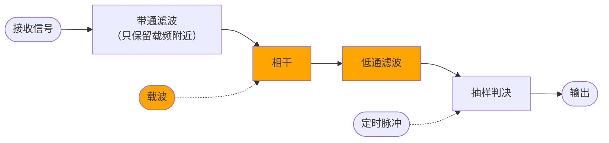

# 二、数字带通传输系统仿真

## 1 简介

### 背景知识

- **数字调制**指解调器把数字基带信号转换为数字带通信号（已调信号）的过程。
- 利用载波相位变化传递信息的方式称作**相移键控**（phase shift keying，PSK）。由于这种体制相位有歧义，又发展出**差分相移键控**（differential PSK，DPSK）。
- 大部分数字调制体制都可采用**相干解调**，这种方法要求接收端恢复出载波。

### 目标

1. 掌握数字带通传输系统的基本知识。
2. 熟悉Matlab环境并编写函数实现功能。
3. 熟悉实验报告的规范写作方法。

## 2 基本原理和算法

### 数字调制

为使信号匹配信道特性，需数字调制。若信号参量可能取值只有两种，则是二进制体制。

BPSK（binary phase shift keying，aka. 2PSK）用载波的相位传递信息。
$$
\begin{aligned}
\text{signal} &= A \cos(\omega_\text{carrier} t + \varphi_n), \\
\varphi_n &= \begin{cases}
    0 & a_n = 0. \\
    \pi & a_n = 1. \\
\end{cases}
\end{aligned}
$$

> 实际信源符号 $a_n$ 与相位 $\varphi_n$ 不一定如此映射。
>
> $n\in\Z$，$t\in\R$。
>
> 以上方式也可表达为 $\pm A \cos(\omega_c t)$。

此外，PSK 用载波相位的绝对数值表示信息，而接收端恢复的载波不能保证和发送端相位一致，存在歧义，接收机可能反相工作。为此可改用 DPSK（differential PSK），如下。
$$
\begin{aligned}
\varphi_n &= \sum \Delta\varphi_n, \\
\Delta\varphi_n &= \begin{cases}
    0 & a_n = 0. \\
    \pi & a_n = 1. \\
\end{cases}
\end{aligned}
$$

> 实际 $a_n \mapsto \Delta\varphi_n$ 不一定如此映射。

DPSK 也可先变换码型，再套用 PSK 的方法。

### 相干解调

相干解调如下图。



对于 DPSK，要么输出前变换码型，要么改用差分相干解调——不再与载波相乘，而与延时一个码元的接收信号相乘。

> 这相当于自相干。不过一般“相干解调”是信号与载波相干，“差分相干解调”与此不同。

### 采样

带通系统本涉及连续波形，而计算机只有抽样后才能表示，抽样后时间只取采样周期的整倍数。

本项目规定记号如下。

| 下标 |    意义     | 解释 |
| :--: | :---------: | :--: |
| $c$  |   carrier   | 载波 |
| $B$  | baud[^baud] |  码  |
| $s$  |  sampling   | 采样 |

[^baud]:Émile Baudot，详见参考文献 2.。

例如，载波与 $\cos(\omega_c t)$ 成正比，码率是 $R_B$（baud/s）或 $f_B$（Hz），采样周期是 $T_s$。

## 3 编程实现

### 生成数字基带信号`generate_signal.m`

> 此部分与前一项目完全相同。

返回一个长为 n 的信号，码元只有0、1，其中1的概率为p。（即 Bernoulli 分布）

1. 先在 $(0,1)$ 生成均匀分布的随机数。
2. 取值小于`p`的作为 1，其它作为 0。
3. 将 logical 数组转换为 numbers。

实际代码如下。其中 arguments 块验证数据类型，不影响程序逻辑，所以我们下面都省略。注释已涵盖在正文，我也不再重复，读者您可阅读附件中源代码或用`help <我的函数名>`查看。

```matlab
function signal = generate_signal(n, p)
%generate_signal - 生成二进制随机信号
%
% signal = generate_signal(n, p) 返回一个长为 n 的信号，码元只有0、1，其中1的概率为p。（即 Bernoulli 分布）
arguments
    n(1,1) {mustBePositive, mustBeInteger}
    p(1,1) {mustBePositive, mustBeNumeric, mustBeLessThanOrEqual(p,1)}
end

signal = rand(1, n) < p;

% logical → numbers
signal = 1 * signal;

end
```

### BPSK 调制`bpsk.m`

输入原始码`s`和码率 $f_B$、载频 $f_c$、采样率 $f_s$ 的比例关系，输出波形`x`。

因为本项目不涉及绝对时间（具体是多少 Hz 多少 s），只关心相对时间，即 $f_B:f_c:f_s$ 这种比例。确定三个量需两个比，我采用了如下组合。

- `periods_per_symbol`: $f_c / f_B$.
- `samples_per_period`: $f_s / f_c$.

另外，可以用`InitialPhase`规定载波初相，实现翻转整个信号。

1. **生成单个码元的载波。**

   下面的`t`是旋转周数，等于 $f_c$ × 实际时间 $t$，无量纲。每个码元持续 $T_B$，对应无量纲旋转周数是 $f_c T_B = f_c/f_B$，即`periods_per_symbol`。采样周期 $T_s$，对应无量纲旋转周数是 $f_c T_s = 1 / \qty(f_s / f_c)$，即`1/samples_per_period`。

   载波 $\cos(\omega_c t + \varphi_0) = \cos(2\pi \times \qty(f_c t) + \varphi_0)$。

   ```matlab
   t = 0: 1/samples_per_period: periods_per_symbol;
   t = t(1: end-1);  % drop the last
   carrier = cos(2 * pi * t + options.InitialPhase);
   ```

   > `left: step: right`表示左闭右也闭区间，直接使用会导致下一周期的第一点和这一周期的最后一点重复。因此要丢弃末点，改成左闭右开。

2. **生成波形。**

   先转换为双极性信号`2*s - 1`，再与载波相乘，得一矩阵，其维度以此为快时间（码元内时间）、慢时间（码元序号）。然后压平。

   ```matlab
   % s → x: 1 → carrier, 0 → -carrier.
   x = carrier.' * (2*s - 1);
   % flatten
   x = reshape(x, 1, []);
   ```

### 相干`interfere.m`

输入波形`x`和 $f_s/f_c$（`samples_per_period`），输出与载波相干的结果`y`。

同样可用`InitialPhase`规定载波初相。

1. **制备载波。**

   ```matlab
   % t 是旋转周数，等于 f_carrier × time。
   t = (0: length(x) - 1) / samples_per_period;
   carrier = cos(2 * pi * t + options.InitialPhase);
   ```

   方法类似`bpsk.m`，但这里不涉及码元怎么划分，按间隔为 $f_c T_s = 1 / \qty(f_s/f_c)$（`1 / samples_per_period`）、分布范围同`x`生成无量纲`t`序列即可。

2. **对应相乘。**

   ```matlab
   y = carrier .* x;
   ```

### 简易滤波器`simple_filter.m`

输入波形`x`和滤波器的单位冲激响应`h`，输出滤波结果`y`。

直接卷积即可。

```matlab
y = conv(x, h);
y = y(1: length(x));
```

卷积后最后一点的时间坐标是`x`、`h`的坐标和，波形变长了。为方便处理，我们直接截断尾巴。

> `conv`函数还提供了其它卷积范围，但都不合适。我们要求`x`、`y`长度相同，并且相同位置的点对应相同时间坐标。
>
> 以下摘自参考文献 3.。
>
> - full（默认）：全卷积。
> - same：与`x`大小相同的卷积的中心部分。
> - valid：仅计算没有补零边缘的卷积部分。使用此选项时，`length(y)`是`max(length(x)-length(h)+1, 0)`，但`length(h)`为零时除外。如果`length(h) = 0`，则`length(y) = length(x)`。
>

### 抽样判决`judge_bipolar.m`

输入双极性波形`x`和 $f_s/f_B$（`samples_per_symbol`），抽样判决为数字序列`s`。

1. **分解时间。**

   ```matlab
   x = reshape(x, samples_per_symbol, []);
   ```

   将`x`转换为矩阵，维度依次是快时间（码元内时间）、慢时间（码元序号）。

2. **抽样。**

   本项目非常理想，几乎处处是“最佳抽样时刻”。但我们还是按实际情况，取码元中间时刻判决，也就是取第一维的`floor(samples_per_symbol / 2)`处。

3. **判决。**

   ```matlab
   s = x(floor(samples_per_symbol / 2), :) > 0;
   % logical → numbers
   s = 1 * s;
   ```

   由于是双极性波形，正数判 1，其余判 0。

   `x(…, :) > 0`是 logical 数组，不方便后续处理，所以我们转换一下。

### 差分编码`diff_code.m`

输入数字序列`u`，转换为差分数字序列`v`。

首个码元的相位仍有歧义，浪费之，固定为 0。故期望输出如下。（其中`+`表示异或）

```matlab
[0, u(1), u(1) + u(2), u(1) + u(2) + u(3), …]
```

——这是一种累计和，我们直接`cumsum`（cumulative sum），再`mod`（modulo）即可。

```matlab
v = mod([0 cumsum(u)], 2);
```

这样虽浪费计算量，但简洁可靠。

### 测试`○○_test.m`

> 这些单元测试是和以上模块同时写的，只是单独列出来。

单元测试我采用基于脚本的测试框架。例如`bpsk_test.m`测试`bpsk`，如下。

```matlab
x = [0 1 1 0];
n = length(x);

%% Sample Rate matches the length
for c = [2 3 9]
    for s = [1 2 5]
        assert(isequal(size(bpsk(x, c, s)), [1 n*c*s]));
    end
end


%% Periodicity
y = bpsk(x, 3, 10);
assert(isequal(y(1:30), - y(31:60)));
assert(isequal(y(1:30), - y(61:90)));
assert(isequal(y(1:30), + y(91:120)));


% ……
```

### 主函数`main.m`等

> 其实并不能叫主“函数”——`main.m`会打印文字、输出图片，高度特化于实验要求，我没有写成函数。

#### 1 生成的信号

调用刚才的函数即可。

本项目采用二进制均匀信源，1 的概率是 0.5。

```matlab
fprintf("## 1 生成的信号\n\n");
raw = generate_signal(100, 0.5);
fprintf("信源序列：%s, …\n\n", join(string(raw(1:10)), ", "));
```

#### 2 调制

还是调用。要求 $f_c = 10 f_B$，$f_s = 100 f_B$，故`periods_per_symbol`为 $f_c/f_B = 10$，`samples_per_period`为 $f_s/f_c = 100/10$。

```matlab
fprintf("## 2 调制\n\n");
modulated = bpsk(raw, 10, 100 / 10);
```

然后画图。画图代码比较繁琐，意义不大，后面不再完整罗列，请直接参考附件源代码。

```matlab
% 绘图 BPSK
figure("Name", "序列、波形开头");

subplot(2, 1, 1);
stem(raw(1: 10));
title("信源序列");
xlabel("码元序号");
ylim([-0.2 1.2]);
% 这里画序列，而后面画波形，二者默认长度不完全相同。
xlim([1 11]);
```

这里只画前 10 点，横坐标范围是1, …, 10，却设置`xlim([1 11])`，是因为下面波形的横坐标范围是 $[1,2),\, [2, 3), \ldots, [10, 11)$，总共 $[0, 11)$，多留个空白方便对齐。

```matlab
subplot(2, 1, 2);
plot(modulated(1: 100 * 10));
xlabel("样本序号");
ylabel("$s_\mathrm{BPSK}(t)$", "Interpreter", "latex");
title("调制波形");

fprintf("请看序列、波形开头。\n");
exportgraphics(gcf(), "../fig/BPSK.jpg");
```

然后是功率谱，用`periodogram`即可。

```matlab
% 绘图 BPSK-freq
figure("Name", "功率谱");
periodogram(modulated);
title("调制波形的功率谱");

fprintf("请看功率谱。\n\n");
exportgraphics(gcf(), "../fig/BPSK-freq.jpg");
```

#### 3 正常解调

同前调用。滤波器的单位冲激响应直接用`ones(1, …)`表示。

```matlab
fprintf("## 3 正常解调\n\n");
x_normal = interfere(modulated, 100 / 10);

y_normal = simple_filter(x_normal, ones(1, 10));
r_normal = judge_bipolar(y_normal, 100);

y_long = simple_filter(x_normal, ones(1, 12));
r_long = judge_bipolar(y_long, 100);

% ……（画图）……
```

#### 4 反相工作

和 3 类似，调用时带上参数`InitialPhase`即可。

```matlab
fprintf("## 4 反相工作\n\n");
x_inverse = interfere(modulated, 100 / 10, "InitialPhase", pi);
y_inverse = simple_filter(x_inverse, ones(1, 10));
r_inverse = judge_bipolar(y_inverse, 100);

% ……（画图）……
```

#### 5 不同步

这一情景中，发送端 $f_c = 10 f_B$，接收端却 $f_c' = 10.05 f_B$，影响相干`interfere`。

仍有采样率 $f_s = 100 f_B$，故接收端认为`samples_per_period`为 $f_s / f_c' = 100 / 10.5$。

其余同 3。

```matlab
fprintf("## 5 不同步\n\n");
x_async = interfere(modulated, 100 / 10.05);
y_async = simple_filter(x_async, ones(1, 10));
r_async = judge_bipolar(y_async, 100);

% ……（画图）……
```

#### 6 DPSK`main_dpsk.m`

DPSK 部分用不到前面的结果，所以单独成文以方便调试。

1. **制备数字序列。**

   与 PSK 相比，还需变换码型，调用`diff_code`。

   ```matlab
   raw = generate_signal(100, 0.5);
   fprintf("信源序列：%s, …\n\n", join(string(raw(1:10)), ", "));
   
   raw_diff = diff_code(raw);
   fprintf("差分序列：%s, …\n\n", join(string(raw(1:10)), ", "));
   ```

2. **调制。**

   ```matlab
   fprintf("## 调制\n\n");
   modulated = bpsk(raw_diff, 10, 100 / 10);
   ```

   画图时，原始序列开始前留出一个空位，供差分编码时浪费。从差分编码开始，信号都会滞后一个码元。

   ```matlab
   % ……
   stem(raw(1: 9));
   title("信源序列");
   xlabel("码元序号");
   % ……
   % 这里画序列，而后面画波形，二者默认长度不完全相同。
   % 还要空出首个码元。
   xlim([0 10]);
   
   % ……
   stem(raw_diff(1: 10));
   title("差分序列");
   xlabel("码元序号");
   % ……
   xlim([1 11]);
   
   % ……
   plot(modulated(1: 100 * 10));
   xlabel("样本序号");
   % ……
   ```

3. **解调。**

   

   > 上图中 $T_s$ 是我们的 $T_B$。

   ```matlab
   fprintf("## 解调\n\n");
   % ……（画图；此段画图很碎，以下不再标注）……
   
   %% 解调：a
   % 没有噪声，带通滤波器我就省略了。
   a = modulated;
   
   %% 解调：b
   b = [zeros(1, 100) modulated(1: end-100)];
   ```

   延迟一个码元，相当于因变量不变，自变量向后平移 $T_B$，合 $f_s T_B = 100$ 个采样点。平移后空处补零（其实补什么都可以），尾部抛弃。

   ```matlab
   %% 解调：c
   c = a .* b;
   
   %% 解调：d
   d = simple_filter(c, ones(1, 10));
   ```

4. **抽样判决。**

   `diff_code`时因首个码元的相位仍有歧义，主动浪费了。这里抽样判决也要抛弃首个码元，从下一码元开始用，即`d(101: end)`。

   又因为本项目 DPSK 采用 0 不变、1 变，而差分相干解调后直接`judge_bipolar`是同相 1、反相 0，同相对应不变、反相对应变，故最后还需取反（`r = 1 - judge_bipolar(…)`）。

   ```matlab
   fprintf("## 抽样判决\n\n");
   r = 1 - judge_bipolar(d(101: end), 100);
   
   % ……（画图）……
   
   if isequal(r, raw)
       fprintf("译码全部正确。\n")
   else
       fprintf("译码错了 %d 位。\n", sum(abs(r - raw)));
   end
   ```

## 4 仿真结果和分析

### 1 生成的信号、2 调制

```matlab
>> main
## 1 生成的信号

信源序列：1, 0, 0, 1, 1, 1, 1, 0, 1, 1, …

## 2 调制

请看序列、波形开头。
请看功率谱。
```

<figure>
    
    <figcaption>各个序列、波形开头</figcaption>
</figure>

请看上图。频率较高，不太方便看相位，但相位变化还是很明显的——信源序列变化时，相位才发生变化。例如信源序列`n = 2`时从 1 变为 0，调制波形确实在 $(2-1) f_s T_B = 100$ 号采样点跳变相位；而`n = 3`时不变，相位也不变。

下面来看功率谱。与前一项目一样，这里与一般的功率谱有以下区别。

- 一般功率谱的自变量是**模拟频率**（rad/s），而这里是数字频率（rad/sample）。

  二者成正比，倍数是 $f_s$ 或 $T_s$。

- 一般功率谱的定义包含**极限和数学期望**，而这里没有，顶多有算术平均。
  $$
  P \coloneqq \lim_{T\to+\infty} \frac{1}{T} \operatorname{\mathbb E} \abs{X_T}^2.
  $$
  一般定义如上，而这里求的只是 $\abs{X_T}^2$，或其算术平均。


<figure>
    
    <figcaption>功率谱</figcaption>
</figure>

BPSK 计算出的功率谱如上图，横坐标表示数字频率，纵坐标按对数表示功率谱密度。

> 横坐标范围本来该是 $\omega \in [0,2\pi)$，但信号是实序列，频谱共轭对称，功率谱偶对称，所以只画 $[0,\pi]$ 就够了。

- $\omega/\pi = 0.2$ 处（左起第一竖线）功率谱密度最大，两侧对称着大体衰减。

  这里对应的载波频率是 $0.2 π / (2π) = 1/10$ 倍 $f_s$，从而等于 $f_c$。BPSK 用载波调制，频谱中载频 $f_c$ 成分最多，符合预期。基带信号的功率谱关于零频对称，正负半轴两侧大体衰减，搬移到 $f_c$ 后保持，符合预期。

- 除了大范围起伏，功率谱中还有很多小峰，每大格（$\Delta\omega / \pi = 0.2$）有 10 个，每个宽度是 $\Delta\omega/\pi = 0.02$。

  这对应 $1/100$ 倍 $f_s$，也就是 $f_B$。BPSK 调制前是双极性不归零基带信号，其功率谱密度为 $\operatorname{sinc}^2$ 型，谱零点间距为 $f_B$，符合预期。

- 没有冲激式尖峰。

  本项目信源均匀分布，双极性信号无稳态分量，无离散谱，符合预期。

从这些特征可总结出 BPSK 波形的特点：

- 无离散谱。
- 主瓣在 $f_c$，宽 $2 f_B$；副瓣对称分布于两侧，每个宽 $f_B$。
- 第一谱零点带宽为 $2f_B$。

### 3 正常解调

<figure>
    
    <figcaption>正常解调情况</figcaption>
</figure>

正常解调情况如上图。

- **相干后波形**与信源序列对应。

  横轴（自变量，时间）与 2 中调制波形一致。

  信源为 1 时，相干后波形位于横轴上方，为 0 时位于横轴下方。

- **正常响应**

  相干搬移频谱到 $0$ 和 $\pm 2f_c$ 两个位置。滤波器单位冲激响应长 10，也就是 $10 T_s = T_c$，其频率响应为 $\operatorname{sinc}$ 型，对称分布在零频两侧，带宽为 $1 / T_c = f_c$。因此搬移到 $\pm 2 f_c$ 那部分刚好命中零点，完全被滤除。

  因此，滤波后波形是纯粹的双极性波形，信源为 1 则为正，0 则为负。振幅为 $\frac12 \times 10 = 5$。

  判决结果因而与信源序列一致。

- **长响应**

  滤波器单位冲激响应长 12，比正常响应长一些，频率响应稍向中心挤压，$\pm 2 f_c$ 分量与零点相错，仅被部分抑制。不过仍是低通滤波器，$0$ 分量安然无恙。

  因此，滤波后波形类似双极性波形，但有轻微波动，波动频率大约是 $2f_c$。平均振幅与正常响应接近。

  由于 $\pm 2f_c$ 被抑制了，影响不大，最终判决结果仍与信源序列一致。

### 4 反相工作

<figure>
    
    <figcaption>反相工作情况</figcaption>
</figure>

由于与 3 中正常情况相比，4 中接收端恢复的载波相位错了 $\pi$，导致相干后波形上下颠倒。于是滤波后波形也跟着相反，判决结果也全都错了。

### 5 不同步

<figure>
    
    <figcaption>不同步情况</figcaption>
</figure>

发送载波频率 $f_c = 10 f_B$，接收端误以为是 $f_c' = 10.05 f_B$，相差 $\Delta f_c = 0.05 f_B$。这导致相干后虽大致满足要求，但存在缓慢变化的 $\Delta f_c$ 的拍频，其周期为 $1 / \Delta f_c = 20 T_B$。

- **相干后波形**

  大致与 3 中正常情况相同，但存在周期为 $20 T_B$ 的余弦式缓慢起伏。上图画了 10 个码元（$\frac12 \times 20 T_B$），第 1 个码元开头（$t = 0$）波形与正常情况完全一致，第 5 个码元结尾（$t = 500 T_s = 5 T_B$）在零上下振荡，第 10 个码元结尾（$t = 1000 T_s = 10 T_B$）与正常情况完全相反。

- **滤波后波形**

  接收端载频稍有误差，并不影响滤波，滤波后波形仍类似双极性波形，但继承了前面的 $20 T_B$ 起伏。

- **判决结果**

  前几个码元（拍频的前 1/4 周期，即 $\frac14 \times 20 T_B = 500 T_s = 5 T_B$）拍频起伏较小，判决仍正确。随着时间流逝，拍频带来的起伏积少成多，在 1/4 周期结束时成为主流，判决出现误判。接着（1/4 至 3/4 周期，对应 5–15 号码元），起伏导致反相，判决连续错误，反而与 4 中反相工作一样。

### 6 DPSK

1. **制备数字序列。**

   ```matlab
   >> main_dpsk
   ## 数字序列
   
   信源序列：0, 0, 0, 1, 0, 1, 1, 0, 0, 0, …
   
   差分序列：0, 0, 0, 1, 0, 1, 1, 0, 0, 0, …
   
   ## 调制
   
   请看序列、波形开头。
   
   ……
   ```

   <figure>
       
       <figcaption>DPSK 各序列、波形开头</figcaption>
   </figure>

   信源序列和 1 生成的信号无本质区别，不再重复。

   差分序列变换自信源序列，找出差分序列（上图第二行）中变化地方，对应到信源序列，刚好就是那些 1。

   注意此处“对应”请按我画的图上下对应，不要按横坐标（码元序号）对应——因为差分序列首个码元仍有歧义，我们主动浪费了，差分序列中实际信息会比信源滞后一个码元。

2. **调制。**

   调制波形（上图第三行）也和 2 调制无本质区别。不过这里调制差分序列（而非调制原始信源序列），在这基础上再做一次差分，会变成原序列——找出调制波形中的跳变点，对应回信源序列，刚好就是那些 1。

3. **解调。**

   

   > 上图中 $T_s$ 是我们的 $T_B$。

   <figure>
       
       <figcaption>DPSK 解调过程</figcaption>
   </figure>

   第一步带通滤波去除噪声产生 a。由于我们根本没噪声，a 和之前的调制波形完全相同。

   延迟 $T_B$ 形成 b，开头空缺处补零。

   a、b 相干得 c。c 时而在横轴上方振荡，时而在下方振荡。找出 c 跳变的地方，对应回 a、b，要么仅 a 跳变，要么仅 b 跳变——若是都不变或都跳变，差分相干后会不变。

   c 低通滤波得 d。如前所述，这里会恢复出变成双极性波形。首个码元被人为抛弃掉，恒零；之后信源为 0 时 d 为正，1 时为负。

4. **抽样判决。**

   ```matlab
   >> main_dpsk
   ……
   
   ## 抽样判决
   
   请看抽样判决结果。
   
   译码全部正确。
   ```

   <figure>
       
       <figcaption>DPSK 判决结果<figcaption>
   </figure>

   抛弃首个码元后，译码当然没什么问题，正确恢复出了信源序列。

## 5 结论

- **数字带通传输系统**

  BPSK、DPSK 体制成功利用带通信道传输了数字信息。

  信源均匀分布时，BPSK 调制信号的功率谱无离散谱，第一谱零点带宽是两倍码率。

  PSK 要求接收端恢复载波，不仅可能反相工作，稍微不同步还会有意外拍频，干扰后续判决。

  DPSK 无需接收端恢复载波，没有歧义。不过这种体制调制、解调时，在信号开头结尾有些特殊，需要专门处理。

- **采样**

  对于模拟信号，计算机抽样成数字信号表示。分析问题时要区分实际时间和无量纲“数字时间”，时刻记得采样这回事。否则容易颠倒黑白，错误嫁接，实现对了也理解不了。

- **测试**

  本项目继续维护了单元测试，效果很好。

## 6 参考文献

1. 曹丽娜,樊昌信. 通信原理 第7版[M]. 北京市: 国防工业出版社, 2022.
1. Wikipedia contributors. "Baud,"  *Wikipedia, The Free Encyclopedia* [EB/OL]. \<https://en.wikipedia.org/w/index.php?title=Baud&oldid=1111891958\>
1. MathWorks. 卷积和多项式乘法[Z/OL]. \<https://ww2.mathworks.cn/help/releases/R2020b/matlab/ref/conv.html\>

此外，我编程时还参考了许多网络文献，列在了附件源代码的`ReadMe.md`中。

---

本项目的代码、文档等存档于[仓库 digital-communication](https://github.com/YDX-2147483647/digital-communication)。不少内容和同学讨论过，万一引发著作权纠纷，请参考我每部分的[提交记录及日期](https://github.com/YDX-2147483647/digital-communication/commits/main)。