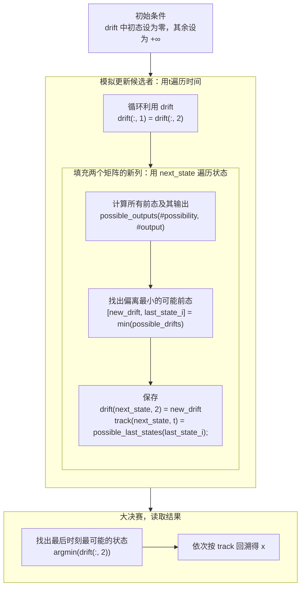
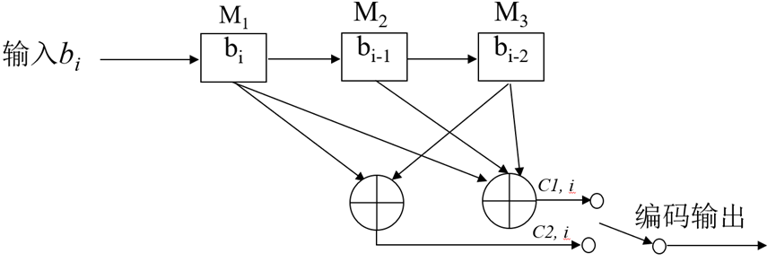
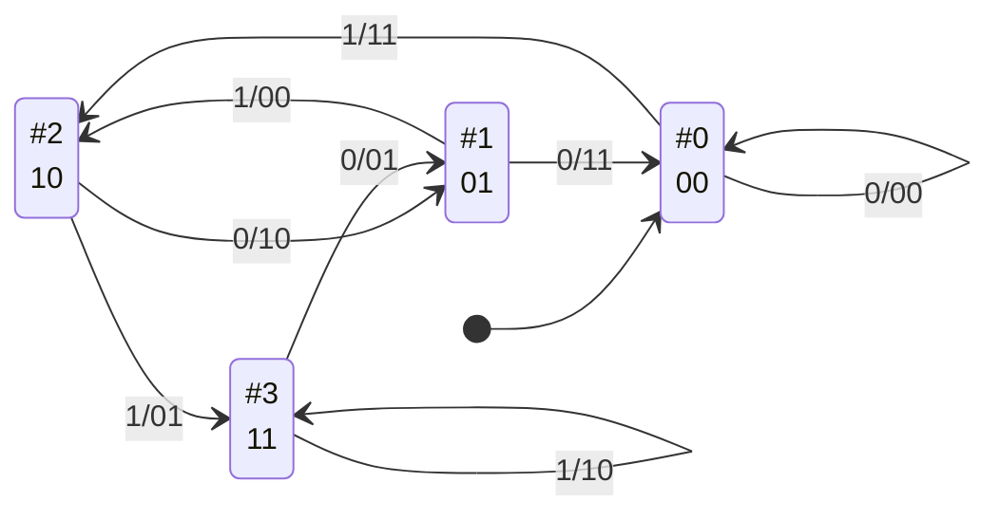
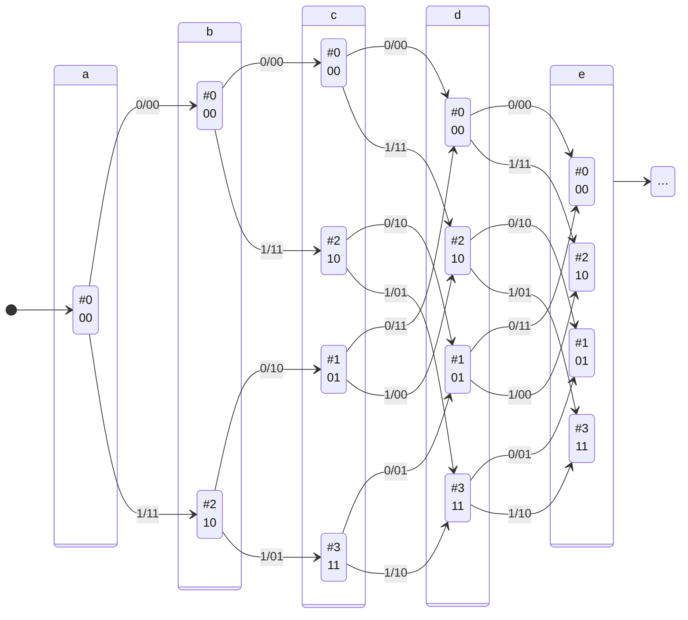

# 三、卷积码的编译码与性能分析

## 1 简介

### 背景知识

- 为了提高信息传输可靠性，使用**信道编码**控制差错。
- **卷积码**是一种纠错编码，非分组。
- **Viterbi 算法**可从卷积码中推断最优译码。

### 目标

1. 掌握卷积编码及维特比译码的基本原理，实现一个（n,k,N）=（2,1,3）的系统。
2. 熟悉Matlab环境并编写函数实现功能。
3. 熟悉实验报告的规范写作方法。

## 2 基本原理和算法

### 卷积码

卷积码的监督位不仅与当前信息段有关，还与之前的信息段有关。

对于 $(n,k,N)$ 卷积码，输出中每一段的长度为 $n$，其中 $k$ 为监督，涉及最近 $N$ 段信息。

$k = 1$ 时，生成矩阵 $G \in \qty{0,1}^{n \times N}$ 定义如下：如输入 $b_i$，$i\in\Z$，则第 $i$ 段输出（$\in \qty{0,1}^n$）
$$
\text{output}_i = G \begin{bmatrix}
    b_i \\
    b_{i-1} \\
    \cdots \\
    b_{i-(N-1)}
\end{bmatrix}.
$$

> 实际 $b_i$ 总有个开头，$i$ 超出取值范围时 $b_i$ 规定为零。

### Viterbi 算法

对于一般正常信道，Hamming 距离都与似然概率负相关。Viterbi 算法会一种信源序列，它编码后结果与实际相差的 Hamming 距离最小。

具体算法见编程实现。

## 3 编程实现

### 编码卷积码`conv_encode.m`

输入信源序列`x`并规定生成矩阵`g`，按卷积码编码出`y`。

1. **卷积。**

   首先构造矩阵`y`，其维度依次为快时间（输出段内序号）、慢时间（输出序号）。

   `x`的维度是慢时间，`g`的维度依次是快时间、慢时间，因此直接在 $\bmod 2$ 意义下卷积即可。

   ```matlab
   y = mod(conv2(x, g), 2);
   y = y(:, 1: length(x));
   ```

2. **压平。**

   ```matlab
   y = reshape(y, 1, []);
   ```

实际代码如下。其中 arguments 块验证数据类型，不影响程序逻辑，所以我们下面都省略。注释已涵盖在正文，我也不再重复，读者您可阅读附件中源代码或用`help <我的函数名>`查看。

```matlab
function y = conv_encode(x, g)
%conv_encode - 按卷积码编码
%
% y = conv_encode(x, g) 将 x 按卷积码编码，g 为生成矩阵
%
% g 的每一行代表一个输出码元，每一列代表一个输入码元。

arguments
    x(1, :)
    g(:, :)
end

y = mod(conv2(x, g), 2);
y = y(:, 1: length(x));
y = reshape(y, 1, []);
    
end
```

### Hamming 距离`hamming_distance.m`

输入序列`a`、`b`，输出距离`d`。如果 a 或（和）b 有多行，每行分别比较。

直接按定义计算即可。

```matlab
d = sum(abs(a - b), 2);
```

### 生成转移方阵`get_transition.m`

这一模块用于 Viterbi 算法。

$(n, 1, N)$ 卷积码编码器是个状态机，输入信源序列，输出编码结果，状态是最近 $N$ 次输入历史。这历史有 $2^N$ 种可能，我们用二进制数 $[0, 2^N) \cap \Z$ 表示，高位表示最近一次输入。

转移方阵`transition`记录了哪些状态之间能转换，哪些不能。例如当前状态是`011`，下一次输入`x`，则状态会且只会变为`x01`，即`001`或`101`——次态的最高位是输入，低位是以往历史，而这已经被当前状态限制住了。
$$
\text{transition}(i,\, j) = \begin{cases}
    1 & \text{状态$\#i$可能转为$\#j$}. \\
    0 & \text{状态$\#i$不可能转为$\#j$}. \\
\end{cases}
$$

> 上式中数组索引应从零开始计数。

`get_transition`模块输入`log_n_state`（状态数以 2 为底的对数，即 $N$），输出`transition`。

1. 用零填充`transition`。

   ```matlab
   n_state = 2 ^ log_n_state;
   
   transition = zeros(n_state, n_state);
   ```

2. 用`s`遍历当前状态，标注所有可能的次态。

   ```matlab
   for s = 0: n_state-1
       next_zero = bitshift(s, -1);
       next_one = bitset(next_zero, log_n_state);
   
       transition(s+1, next_zero+1) = 1;
       transition(s+1, next_one+1) = 1;
   end
   ```

   若输入零，则次态为`next_zero`；若输入一，则次态为`next_one`。

   因为数组索引从 1 开始，标注时还要加一。

### 用 Viterbi 算法解码卷积码`conv_decode.m`

将`y`按卷积码解码，`g`为生成矩阵。

我们遍历`#time`，模拟编码器一个一个发出符号，同时依次填充两个矩阵的`#time`列，它们的定义如下。

- **`drift`**

  若`#time`时处于`#state`，则此时编码结果（与实际接收到的）偏离了`drift(#state, #time)`（按 Hamming 距离度量）。

  例如，若`t = 3`时编码器的状态是`010`，即`#2`，此时会输出`00 11 00`。然而实际接收到的是`00 10 00`，相差 1。于是`t = 3`时，我们会将`drift(#2, 3)`填充为 1。

  在实际实现中，我们只保留最后两列，数据随用随抛。因此`drift`的`#time`维度实际只有 2。

- **`track`**

  若`#time`时处于`#state`，则`#time - 1`时最可能处于`track(#state, #time)`。

  例如，设`t = 3`时编码器的状态是`#2`。编码器前一时刻（`t = 2`）肯定也在某一状态，只是刚刚转变为`#2`。如果我们判断前态最可能是`#4`，那么我们`t = 3`时会将`track(#2, 3)`填充为`#4`。

> 我们规定，`#state`都应从零开始数。

更详细的计划如下。



> 上图中为简洁，假设矩阵的`#state`维度从零开始计数。

1. **补充辅助工具。**

   分解`y`的时间为快时间`#output`、慢时间`#time`，导出一些参数，生成转移方阵`transition`。

   ```matlab
   % y(#output, #time)
   y = reshape(y, size(g, 1), []);
   n_time = size(y, 2);
   log_n_state = size(g, 2) - 1;
   n_state = 2 ^ log_n_state;
   
   transition = get_transition(log_n_state);
   ```

2. **初始条件——初态必为 0。**

   `drift`中初态设为`0`，其余设为`inf`。

   ```matlab
   drift = zeros(n_state, 2);
   drift(2:end, 2) = inf;
   ```

   另外申请一下数组。

   ```matlab
   track = zeros(n_state, n_time);
   ```

3. **更新候选者。**

   用`t`<u>遍历</u>时间`1: n_time`。

   准备填充`drift`的新列，旧列先备份一下，再旧的一列可以抛弃了。

   ```matlab
       %% Save the old, i.e. drift(:, 1)
       drift(:, 1) = drift(:, 2);
   ```

   **填充两个矩阵的新列**，用`next_state`<u>遍历</u>状态`0: n_state-1`。

   1. **计算所有前态及其输出。**

      根据`transition`列出所有可能前态。

      ```matlab
      % possible_last_states(#possibility)
      possible_last_states = find(transition(:, next_state+1)) - 1;
      ```

      将状态（次态、前态）转换为最近输入历史。例如次态`next_state`是`110`，可能前态之一是`101`，先拼接为`1101`，转换为`'1101'`，最后拆分为`[1 1 0 1]`。

      ```matlab
      % possible_histories(#possibility, #input)
      % (previous and next state) → concatenated state
      % → text → array.
      possible_histories = bitset(possible_last_states, log_n_state+1, ...
                                  bitget(next_state, log_n_state));
      possible_histories = dec2bin(possible_histories, log_n_state+1) - '0';
      ```

      根据历史来编码，确定每种情况的输出。注意刚才的历史是倒序，所以这里相关（矩阵乘法）而不卷积。

      ```matlab
      % possible_outputs(#possibility, #output)
      possible_outputs = mod(possible_histories * g', 2);
      ```

   2. **找出偏离最小的可能前态。**

      总偏离 = 前态偏离 + 新增偏离，前者从`drift`读取，后者从`possible_outputs`计算。

      ```matlab
      possible_drifts = ...
          drift(possible_last_states+1, 1) + ...
          hamming_distance(possible_outputs, y(:, t).');
      
      [new_drift, last_state_i] = min(possible_drifts);
      ```

   3. **保存。**

      ```matlab
      drift(next_state+1, 2) = new_drift;
      track(next_state+1, t) = possible_last_states(last_state_i);
      ```

      因为数组索引从 1 开始，存储时还要加一。

4. **大决赛，读取结果。**

   从`drift`找出最后时刻最可能的状态。

   ```matlab
   [~, last_state] = min(drift(:, 2));
   last_state = last_state - 1;
   ```

   依次按`track`倒着回溯得`x`。

   ```matlab
   x = zeros(1, n_time);
   for t = n_time: -1: 1
       x(t) = bitget(last_state, log_n_state);
       last_state = track(last_state+1, t);
   end
   ```

我们的算法没有考虑平局。平局时存在多种状态路径使偏离最小，这时我们给出任意一条路径即达目的。

### 测试`○○_test.m`

> 这些单元测试是和以上模块同时写的，只是单独列出来。

单元测试我采用基于脚本的测试框架。例如`conv_test.m`测试`conv_encode`和`conv_decode`，如下。

```matlab
x = [1 0 1 1];
g = [1 1; 1 0];
y = conv_encode(x, g);
x_hat = conv_decode(y, g);


%% Shapes
assert(isequal( ...
    size(y), ...
    [1 length(x) * size(g, 1)] ...
));
assert(isequal( ...
    size(x_hat), ...
    size(x) ...
));


%% Encode example
assert(isequal( ...
    y, ...
    [1 1 1 0 1 1 0 1] ...
));


%% Decode example
assert(isequal( ...
    x, ...
    x_hat ...
));
```

可以看到，测试用例比本项目后面实际做的更简单。因为要手动计算测试用例，太复杂会很难保证人不出错。

### 主函数`main.m`

> 其实并不能叫主“函数”——`main.m`会打印文字、输出图片，高度特化于实验要求，我没有写成函数。

#### 编码

抄下来`b`、`g`，调用`conv_encode`即可。

```matlab
fprintf("## 编码\n\n");

b = [1 1 0 1 1 1 1 1 0 0];
fprintf("- 信源序列 b:    %s.\n", join(string(b), ",    "));

g = [1 1 1; 1 0 1];
c = conv_encode(b, g);
fprintf("- 编码序列 c: %s.\n\n", join(string(c), ", "));
```

$(2,1,3)$ 卷积码每个信源符号对应一段输出。为了对齐，打印`b`、`c`时的起点、间距并不相同。下面也有类似情况，不再重复。

#### 译码

调用`conv_decode`即可。

```matlab
fprintf("## 译码\n\n");

d = conv_decode(c, g);
fprintf("- 译码序列 d:    %s.\n\n", join(string(d), ",    "));

if isequal(d, b)
    fprintf("✓ 译码全部正确。\n\n")
else
    fprintf("✗ 译码错了 %d 位。\n\n", sum(abs(d - b)));
end
```

#### 纠错

沿用发送序列，在传输过程中捣乱，看看接收方会怎样。

1. **准备捣乱。**

   用`randi`随机生成两个正整数，作为出错的位置`error_i`。例如，随机生成出 5、6，那么就让第 5、6 位出错；若两数相等，就只让那一位出错。

   然后建立错误图样`e`，要出错的地方设为 1，其余为 0。

   ```matlab
   fprintf("## 纠错\n\n");
   
   error_i = randi(numel(c), 1, 2);
   e = zeros(size(c));
   e(error_i) = 1;
   fprintf("- 错误位置:   %s.\n", join(string(e), ", "));
   ```

2. **传输。**

   发送序列异或错误图样就是接收序列。

   ```matlab
   disturbed = bitxor(c, e);
   fprintf("- 接收序列:   %s.\n", join(string(disturbed), ", "));
   ```

3. **译码。**

   调用`conv_decode`即可。

   ```matlab
   recovered = conv_decode(disturbed, g);
   fprintf("- 译码序列:      %s.\n\n", join(string(recovered), ",    "));
   if isequal(recovered, b)
       fprintf("✓ 译码全部正确。\n\n")
   else
       fprintf("✗ 译码错了 %d 位。\n\n", sum(abs(recovered - b)));
   end
   ```

## 4 仿真结果和分析

```matlab
>> main
## 编码

- 信源序列 b:    1,    1,    0,    1,    1,    1,    1,    1,    0,    0.
- 编码序列 c: 1, 1, 0, 1, 0, 1, 0, 0, 0, 1, 1, 0, 1, 0, 1, 0, 0, 1, 1, 1.

## 译码

- 译码序列 d:    1,    1,    0,    1,    1,    1,    1,    1,    0,    0.

✓ 译码全部正确。

## 纠错

- 错误位置:   0, 1, 0, 0, 0, 0, 0, 0, 1, 0, 0, 0, 0, 0, 0, 0, 0, 0, 0, 0.
- 接收序列:   1, 0, 0, 1, 0, 1, 0, 0, 1, 1, 1, 0, 1, 0, 1, 0, 0, 1, 1, 1.
- 译码序列:      1,    1,    0,    1,    1,    1,    1,    1,    0,    0.

✓ 译码全部正确。
```

> “纠错”一节实际运行结果随机。

### 1–4 编码



比较`b`与`c`，确实`b`中每个符号对应`c`中 $n$ 个。

并且具体数字也符合预期，比如`c(2*2 + 1) = c(5) = 0`，确实等于`b(3) + b(2) + b(1) = 0 + 1 + 1 = 0`。

状态转移图如下。



网格图如下。



### 5–6 译码

### 7 纠错

## 5 结论

## 6 参考文献

1. 曹丽娜,樊昌信. 通信原理 第7版[M]. 北京市: 国防工业出版社, 2022.

此外，我编程时还参考了许多网络文献，列在了附件源代码的`ReadMe.md`中。

---

本项目的代码、文档等存档于[仓库 digital-communication](https://github.com/YDX-2147483647/digital-communication)。不少内容和同学讨论过，万一引发著作权纠纷，请参考我每部分的[提交记录及日期](https://github.com/YDX-2147483647/digital-communication/commits/main)。