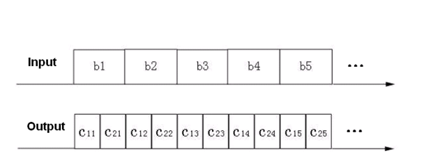
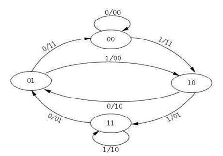

# 卷积码的编译码与性能分析

## 实验目的

1. 掌握卷积编码及维特比译码的基本原理，实现一个（n,k,N）=（2,1,3）的系统。
2. 熟悉Matlab环境并编写函数实现功能。
3. 熟悉实验报告的规范写作方法。

## 实验内容

1. 生成源二进制序列`b=[1101111100]`。

2. [x] 考虑如下卷积编码器：生成矩阵的行向量为`g1 = [111]`，`g2 = [101]` 

   

   根据生成矩阵的系数，设计一个能够实现卷积编码器的函数。

3. [x] 取`b=[1101111100]`为所设计编码器的输入序列，求出输出序列c并验证。

   

4. [x] 状态转移图如下，画出对应的网格图。

   

5. [x] 根据上述卷积编码器，用Matlab编程设计对应的维特比译码函数，使用汉明距离作为度量。

6. [x] 将序列c作为译码器函数的输入，得到序列d，d是否等于b？如果不相等，请解释原因。

7. [x] 更改序列c的一位或者两位，然后尝试使用所设计的译码器再次译码。会发生什么现象？